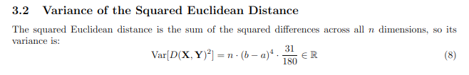

# DIEM: Dimension Insensitive Euclidean Metric (DIEM)

This repository implements the distance measure metric: DIEM.

source: [https://arxiv.org/abs/2407.08623](https://arxiv.org/abs/2407.08623)

Note: Please cite the original paper.

## Development

Please feel free to suggest code & math fixes if found.

```bash
make all
```

## Proof

For the full proof refer: [Euclidean Distance: Expectation, Variance & Std. Deviation](documents/proof.pdf)

- The missing term `\sigma(n)^2` in the equation DIEM presented in the paper:

    
